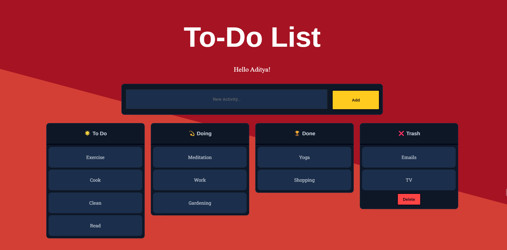

# To-Do List
A simple task manager built with HTML, CSS, and JavaScript using Dragula and Vanilla JS.



## Features
- Add new tasks
- Move tasks between columns: To Do, Doing, Done, and Trash
- Clear tasks in the Trash column

## Getting Started

1. Clone the repository:
   ```bash
   git clone https://github.com/dormeneur/To-Do-List.git

